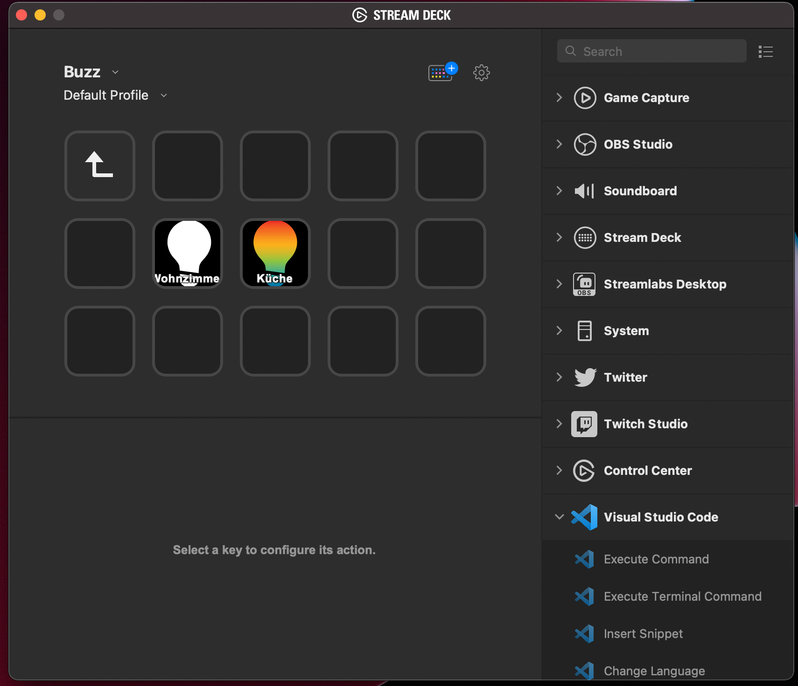

`AzurePipeline` is a simple Plugin to view your current Pipeline runs

# Description

`AzurePipeline` is a plugin that displays the current status of your Azure Pipeline.
You can see your pipeline running, succeed or fail.

You can also click on the button which brings you right to the Pipeline.

This product was not developed or approved by Azure

# Properties

You have to set the following properties

 - Company Name
 - Project
 - Access Token (with the following rights)
   - Build(Read)
   - Release(Read)
 - Pipeline ID (get it from the URL, called definitionId)
 - run Index -> starting at 0 für the current run up to 30 for the 30th run

# Features

- code written in Javascript
- cross-platform (macOS, Windows)
- Property Inspector with multiple UI elements

# Installation

In the Release folder, you can find the file `com.buzzet.azurepipeline.streamDeckPlugin`. If you double-click this file on your machine, Stream Deck will install the plugin.

# Source code

The Sources folder contains the source code of the plugin.
